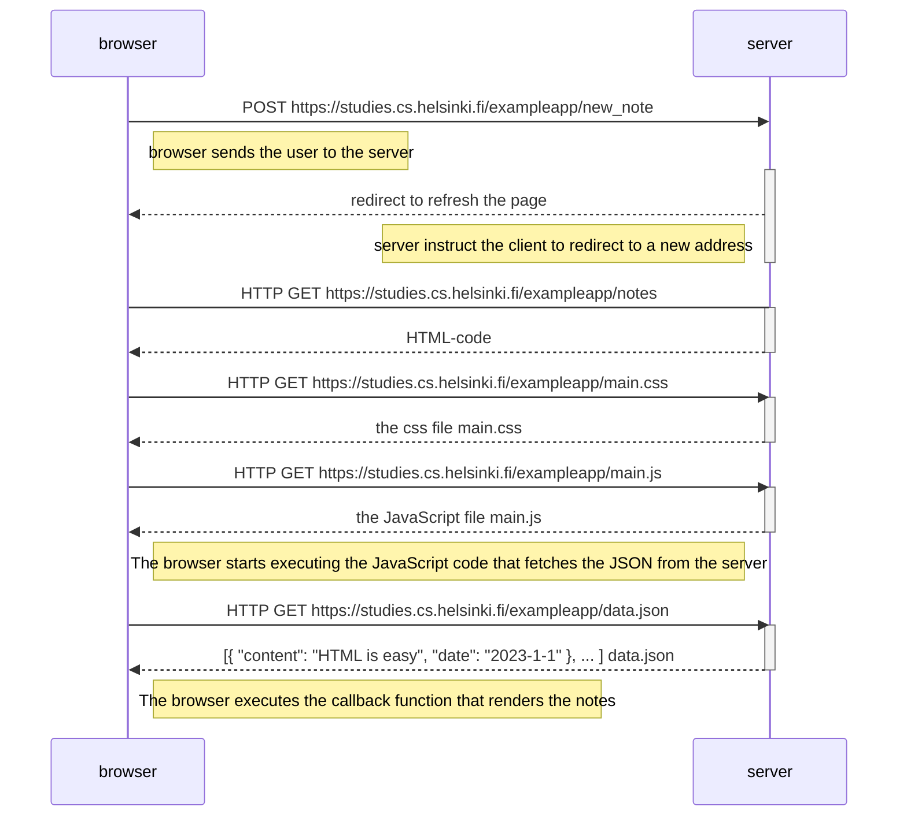

The answer of assignment 0.4

```mermaid
sequenceDiagram
  participant browser
  participant server

  browser->>server: POST https://studies.cs.helsinki.fi/exampleapp/new_note 

  note right of browser: browser sends the user to the server

  activate server
  server-->>browser: redirect to refresh the page
  note left of server: server instruct the client to redirect to a new address
  deactivate server

  browser->server: HTTP GET https://studies.cs.helsinki.fi/exampleapp/notes
  activate server 
  server-->>browser: HTML-code
  deactivate server

  browser->>server: HTTP GET https://studies.cs.helsinki.fi/exampleapp/main.css
  activate server
  server-->>browser: the css file main.css
  deactivate server

  browser->>server: HTTP GET https://studies.cs.helsinki.fi/exampleapp/main.js

  activate server
  server-->>browser: the JavaScript file main.js
  deactivate server

  Note right of browser: The browser starts executing the JavaScript code that fetches the JSON from the server

  browser->>server: HTTP GET https://studies.cs.helsinki.fi/exampleapp/data.json
  activate server
  server-->>browser: [{ "content": "HTML is easy", "date": "2023-1-1" }, ... ] data.json
  deactivate server

  Note right of browser: The browser executes the callback function that renders the notes
```