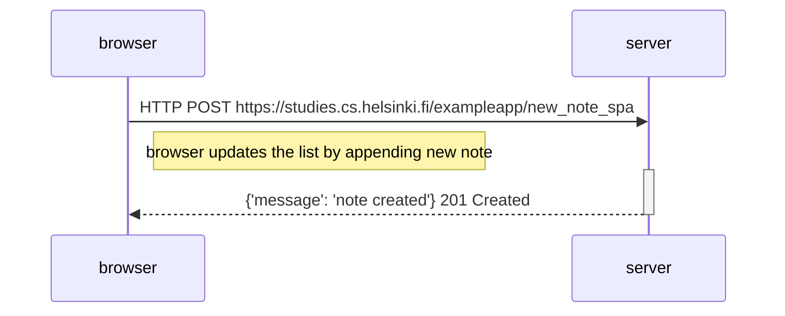

The answer of assignment 0.6

```mermaid
sequenceDiagram
  participant browser
  participant server

  browser->>server: HTTP POST https://studies.cs.helsinki.fi/exampleapp/new_note_spa

  note right of browser: browser updates the list by appending new note

  activate server
  server-->>browser: {'message': 'note created'} 201 Created
  deactivate server
```